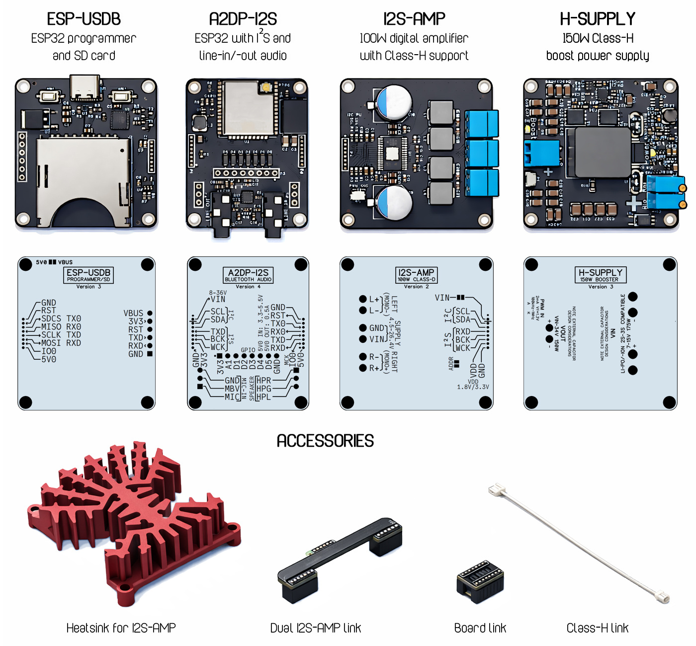

# Complete ESP32 bluetooth speaker solution

This project is not fully open source (non-commercial use) and is tied to a specific hardware ecosystem. However, each component is designed to stand on its own and is documented to be broadly useful.

The goal is to provide clear, usable references and code for hobbyists while also demonstrating commercial engineering capabilities in embedded audio and DSP.

The repository covers practical topics such as building high-end A2DP audio on ESP32, working with TAS58xx mid-power amplifiers and their DSP blocks, and the design and use of biquads and polyphase filter banks.

## Hardware

Designed for:
- DS prototyp A2DP-I2S(ESP32 + [SGTL5000](https://www.nxp.com/products/SGTL5000) development board)
- DS prototyp I2S-AMP ([TAS5828M](https://www.ti.com/product/TAS5828M)/[TAS5830](https://www.ti.com/product/TAS5830) digital amplifier)

Optionally complimented by:
- DS prototyp H-SUPPLY (Class-H envelope tracking boost supply)
- DS prototyp ESP-USDB (ESP32 programmer + SD card adapter)
	
Notable high-end features:
- [True clock drift compensation](#clock-drift-compensation)
- [Polyphase resampling](#polyphase-resampling)
- [Live system response tuning](#filter-design-and-live-tuning)

Notable support software:
- [Biquad filter design package](https://github.com/stg/A2DP-I2S/blob/main/BluetoothI2S-Core/Biquad.cpp)
- [Biquad filter design app](#filter-design-and-live-tuning)
- [Polyphase filter design program](https://github.com/stg/A2DP-I2S/tree/main/tools)
- [Binary resource to C/C++ injector](https://github.com/stg/A2DP-I2S/blob/main/tools/README.md)

---



---

## Sound effects

Sound effects (MP3) are stored in `BluetoothI2S-Core/sfx/` and embedded in `BluetoothI2S-Core/Resources.cpp`.

Resource injection is handled by [tools/resource_inject.py](https://github.com/stg/A2DP-I2S/blob/main/tools/resource_inject.py) and documented in [tools/README.md](https://github.com/stg/A2DP-I2S/blob/main/tools/README.md).

To regenerate the embedded sound effects:

```text
python tools\resource_inject.py BluetoothI2S-Core\Resources.cpp sfx\logo.mp3 sfx\connect.mp3 sfx\disconnect.mp3 -c 32
```

## TAS5828M/TAS5830/TAS5837 driver

Includes a mostly complete driver able to use primary DSP blocks:

- Hybrid PWM (class-h)
- Equalizer (biquad)
- InputMixer
- Volume
- DPEQ (dynamic parametric equalizer)
- DRC (dynamic range compressor)
- PostEQ
- AGL (automatic gain leveler)
- Clipper
- Crossbar

Biquad filter design package is included: [Biquad.cpp](https://github.com/stg/A2DP-I2S/blob/main/BluetoothI2S-Core/Biquad.cpp)

## SGTL5000 driver

Includes a mostly complete driver able to use primary DSP blocks:

- Equalizer (biquad)
- Equalizer (parametric)
- Surround
- Bass booster
- AGL
- Volume
- Microphone
- Line in/out
- Headphone amp
- DAC, DSP and analog path control

Biquad filter design package is included: [Biquad.cpp](https://github.com/stg/A2DP-I2S/blob/main/BluetoothI2S-Core/Biquad.cpp)

## Clock drift compensation

Since an A2DP connection involves two clocks...

- The source clock (producing device, e.g. cell-phone)
- The sink clock (consuming device, e.g. speaker)

...we have a clock domain synchronization problem because one side will produce audio at a slightly different rate than the receiver will play that data back.

The common inelegant solution is to simple drop/duplicate incoming samples.
There are several much more elegant ways of solving this, including clock synchronization and resampling.
This code in particular uses a clock skew detector (may be in ppm) and resampling of the stream to the local clock.

## Polyphase resampling

Fast resampling to solve both clock-drift and up-sampling can be tricky.
This code uses a dual polyphase up/down SRC with excellent image rejection and alias suppression, far exceeding cheaper implementations.

Polyphase filter design program is included (Python): [tools/polyphase_dude.py](https://github.com/stg/A2DP-I2S/blob/main/tools/polyphase_dude.py)

## Filter design and live tuning

Filter design and live tuning (equalizer/biquad) can be performed using this application:

[http://www.dsprototyp.se/bqdts/](http://www.dsprototyp.se/bqdts/)

Live tuning is based on sending special AVRCP metadata, which can be a bit fragile.
Tested on Windows 10 and Windows 11.
To ensure best chance of getting this to work:
- Ensure no other media application is running
- Ensure playback is active

For the backend that supports professional-grade audio paths in BQDTS, see [bqdts-backend](https://github.com/stg/bqdts-backend).

## LICENSE

This project is free for personal/non-commercial use.
Commercial use requires permission.

See LICENSE.
